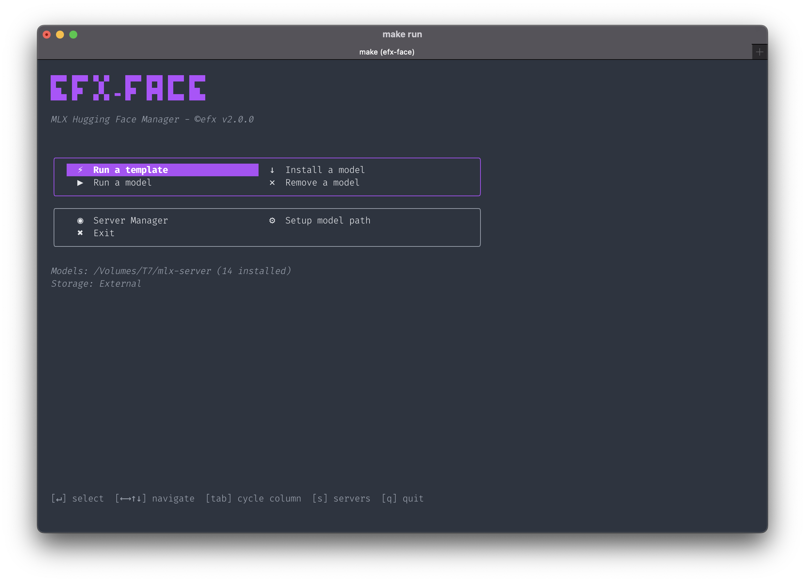
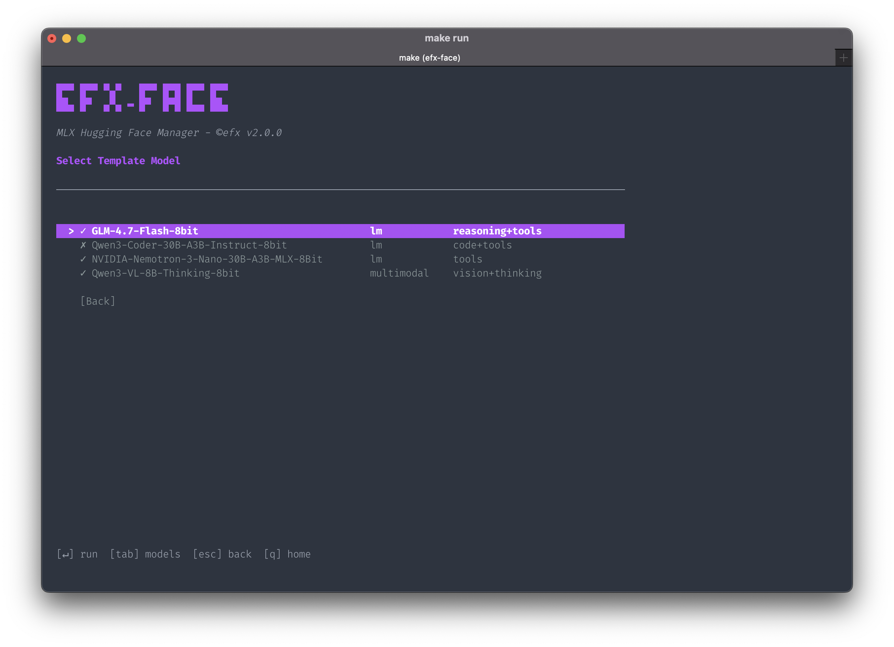
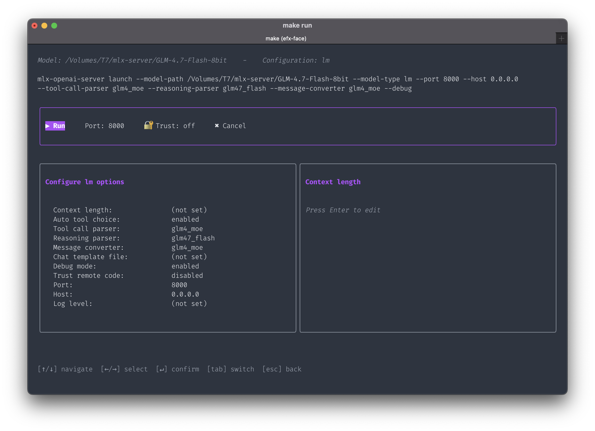
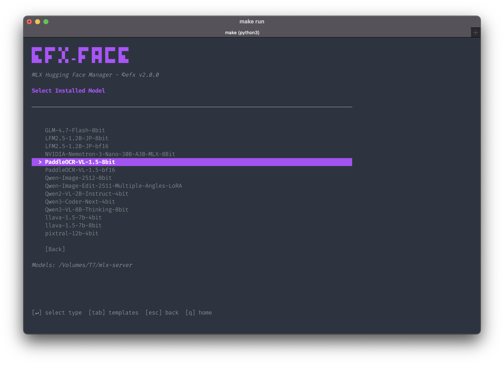
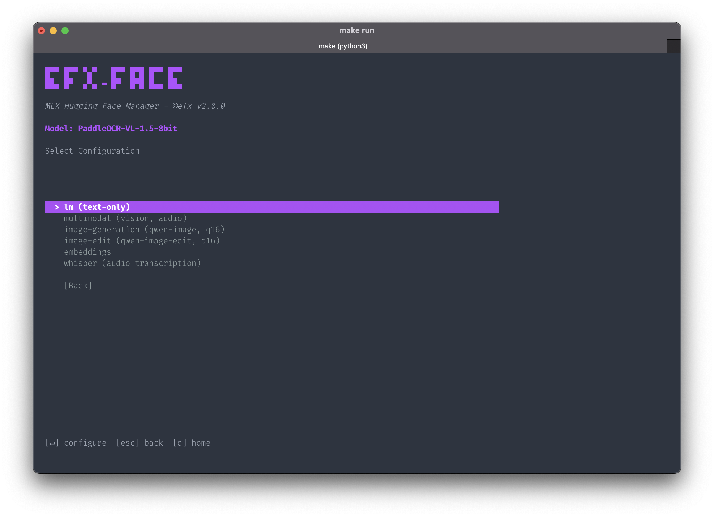
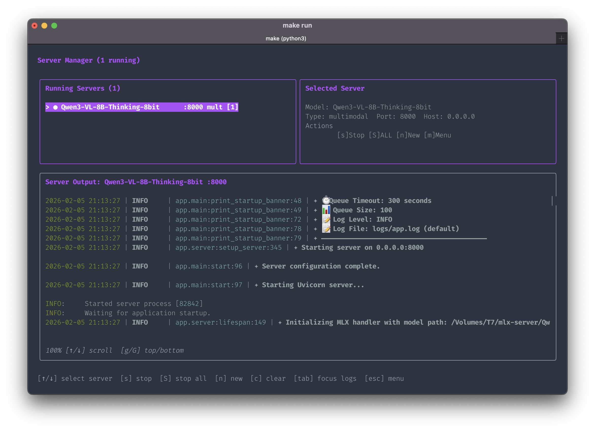
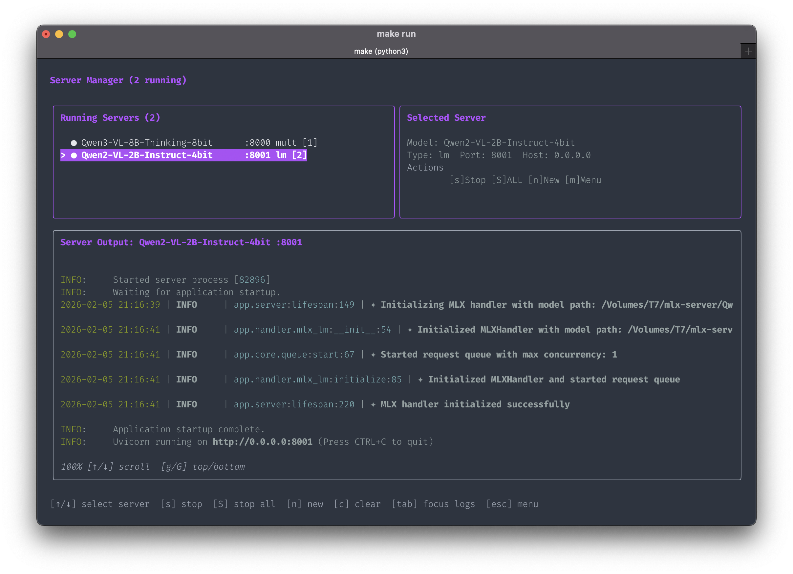
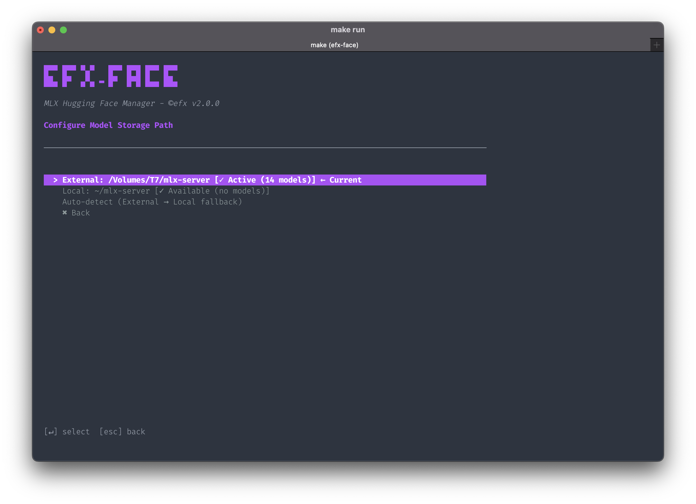
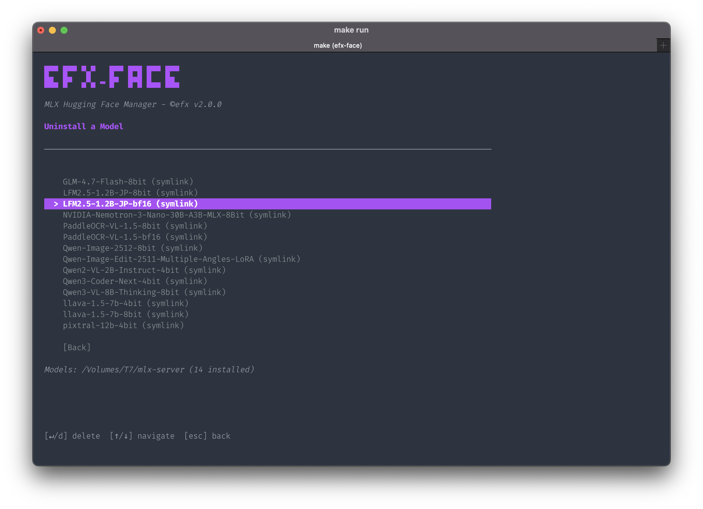

# efx-face


**Version 2.0.0** | A beautiful TUI for managing MLX models on Apple Silicon

Browse, install, and run MLX-optimized models from Hugging Face with an intuitive terminal interface built with [Bubbletea](https://github.com/charmbracelet/bubbletea) and [Lipgloss](https://github.com/charmbracelet/lipgloss).

---

## Table of Contents

- [Features](#features)
- [Installation](#installation)
- [Prerequisites](#prerequisites)
- [How to Use](#how-to-use)
  - [Home Screen](#home-screen)
  - [Running Models with Templates](#running-models-with-templates)
  - [Running Installed Models](#running-installed-models)
  - [Server Management](#server-management)
  - [Settings](#settings)
  - [Uninstalling Models](#uninstalling-models)
- [Keyboard Reference](#keyboard-reference)
- [Building](#building)
- [Troubleshooting](#troubleshooting)
- [Credits](#credits)

---

## Features

### Core Features
- **Browse Models** — Access 3000+ MLX models from Hugging Face with pagination
- **Unified Search** — Search models directly via Hugging Face API with live filtering
- **Model Details** — View downloads, likes, size, and metadata before installing
- **Install Models** — Download and set up models with one click
- **Run Models** — Launch models with MLX OpenAI Server
- **Uninstall** — Clean removal of models and cache
- **Multiple Sources** — Browse mlx-community, lmstudio-community, or all models

### Multi-Server Management
- **Run Multiple Servers** — Launch several models on different ports simultaneously
- **Real-time Logs** — View server output with scrollable viewport
- **Server Switching** — Switch between running servers to view their logs
- **Graceful Shutdown** — Stop individual servers or all at once

### Configuration Options
- **6 Model Type Presets**: `lm`, `multimodal`, `image-generation`, `image-edit`, `embeddings`, `whisper`
- **Interactive Configuration** — Single-page settings with live preview
- **Command Preview** — Review full command before execution
- **Flexible Storage** — Configure external or local model storage paths

---

## Installation

### Quick Install (Recommended)

```bash
curl -fsSL https://raw.githubusercontent.com/electroheadfx/efx-face-manager/main/install.sh | bash
```

This will:
- Detect your OS and architecture
- Download the correct binary
- Install to `/usr/local/bin`
- Create default config with model directory

### Manual Download

Download from [Releases](https://github.com/electroheadfx/efx-face-manager/releases):

| Platform | Architecture | Binary |
|----------|--------------|--------|
| macOS | Apple Silicon (M1/M2/M3/M4) | `efx-face-darwin-arm64` |
| macOS | Intel | `efx-face-darwin-amd64` |
| Linux | x86_64 | `efx-face-linux-amd64` |
| Linux | ARM64 | `efx-face-linux-arm64` |
| Windows | x86_64 | `efx-face-windows-amd64.exe` |
| Windows | ARM64 | `efx-face-windows-arm64.exe` |

```bash
# macOS/Linux
chmod +x efx-face-darwin-arm64
sudo mv efx-face-darwin-arm64 /usr/local/bin/efx-face
efx-face
```

### Build from Source

```bash
git clone https://github.com/electroheadfx/efx-face-manager.git
cd efx-face-manager
make build
./bin/efx-face
```

### Go Install

```bash
go install github.com/electroheadfx/efx-face-manager/cmd/efx-face@latest
```

---

## Prerequisites

### MLX OpenAI Server

Required to run models. Install using uv (recommended):

```bash
git clone https://github.com/cubist38/mlx-openai-server.git
cd mlx-openai-server
uv venv && source .venv/bin/activate
uv pip install -e .
```

Add to `.zshrc`:

```bash
mlx-openai-server() {
    local original_dir="$PWD"
    cd ~/path/to/mlx-openai-server
    source .venv/bin/activate
    command mlx-openai-server "$@"
    cd "$original_dir"
}
```

Or use pipx: `pipx install mlx-openai-server`

### Hugging Face CLI

```bash
brew install huggingface-cli
# Optional: hf auth login
```

---

## How to Use

### Home Screen



The **Home Screen** is your central hub for all operations:

- **Run on Template** — Quick-launch popular models with pre-configured optimal settings
- **Run an Installed Model** — Select any model you've downloaded and configure how to run it
- **Install a New Model** — Browse and download models from Hugging Face
- **Uninstall a Model** — Remove models you no longer need
- **Settings** — Configure storage paths and preferences

Use `↑/↓` to navigate, `Enter` to select, and `q` to quit.

---

### Running Models with Templates

#### Step 1: Choose a Template



Templates are **pre-configured model setups** optimized for specific use cases:

- **GLM-4.7-Flash-8bit** — Fast Chinese/English language model with reasoning
- **Qwen3-Coder-30B** — Optimized for coding tasks
- **Qwen3-VL-8B-Thinking** — Vision-language multimodal model
- **PaddleOCR-VL-1.5** — OCR-focused vision models (8-bit and bf16 variants)
- **NVIDIA-Nemotron** — General purpose language model

**All Templates Configurable:** All templates are loaded from `~/.config/efx-face-manager/templates.yaml`. You can modify existing templates or add new ones. See `templates.example.yaml` for the format.

Select a template and press `Enter` to proceed to configuration.

#### Step 2: Configure and Launch



The **Configuration Panel** shows everything at a glance:

**Left Column — Configure Options:**
- Context length, tool parsers, reasoning parsers
- Debug mode, trust remote code settings
- Port, host, and log level

**Right Column — Option Setup:**
- Shows available choices for the selected option
- Press `Enter` to edit a value
- Changes update the command preview in real-time

**Action Bar (top):**
- `Run` — Launch the server with current settings
- `Trust: off/on` — Quick toggle for trust_remote_code
- `Cancel` — Return to previous screen

Use `Tab` to switch between panels, `↑/↓` to navigate options.

---

### Running Installed Models

#### Step 1: Choose a Model



Browse all models installed in your storage directory:

- Models are displayed with their full names
- Use `↑/↓` to scroll through the list
- Press `Enter` to select a model

#### Step 2: Select Model Type



Choose the **model type** that matches your use case:

| Type | Description |
|------|-------------|
| `lm` | Text-only language models (default) |
| `multimodal` | Vision, audio, and text processing |
| `image-generation` | Image generation (Qwen, Flux) |
| `image-edit` | Image editing capabilities |
| `embeddings` | Text embeddings for RAG |
| `whisper` | Audio transcription |

Each type shows different configuration options in the next screen.

---

### Server Management

#### Single Server View



When a server is running, the **Server Manager** displays:

**Left Panel — Server Controls:**
- List of running servers with model name, port, and type
- Server details (host, uptime)
- Actions: Stop server, Start new, Back to menu

**Right Panel — Server Output:**
- Real-time scrollable log output
- Shows model loading progress, requests, and responses
- Use `↑/↓` or `g/G` to scroll through logs

**Shortcuts:**
- `s` — Stop selected server
- `n` — Start a new server
- `c` — Clear logs
- `m` — Return to main menu

#### Multiple Servers



Run **multiple models simultaneously** on different ports:

- Each server runs independently on its own port (8000, 8001, 8002...)
- Select a server from the list to view its logs
- Press `1-9` for quick server selection
- `S` (shift+s) stops ALL running servers

This is perfect for:
- Running a coding model and a general model side by side
- Testing different model configurations
- Serving multiple model types (LLM + embeddings + whisper)

---

### Settings



Configure your **model storage location**:

**Available Paths:**
- **External** — `/Volumes/T7/mlx-server` (for external drives)
- **Local** — `~/mlx-server` (always available)
- **Auto-detect** — Automatically uses external if mounted, falls back to local

The status shows:
- ✓ Active with model count
- ✓ Available (empty directory)
- ✗ Not mounted (external drive disconnected)

Settings are saved to `~/.efx-face-manager.conf` and persist across sessions.

---

### Uninstalling Models



Remove models you no longer need:

1. Select the model to uninstall
2. Confirm the deletion
3. Both the symlink AND cached files are removed

This frees up disk space by cleaning the Hugging Face cache.

---

## Keyboard Reference

| Key | Action |
|-----|--------|
| `↑/↓` | Navigate lists and options |
| `Enter` | Select / Confirm |
| `Tab` | Switch between panels |
| `←/→` | Switch pages / columns |
| `ESC` | Go back one screen |
| `q` | Quit / Return to home |
| `s` | Stop selected server |
| `S` | Stop ALL servers |
| `n` | Start new server |
| `c` | Clear server logs |
| `g/G` | Jump to top/bottom of logs |

---

## Building

```bash
make build         # Current platform
make build-all     # All 6 platforms
make build-mac     # macOS ARM64 + AMD64
make build-linux   # Linux ARM64 + AMD64
make build-windows # Windows ARM64 + AMD64
make release       # Build + create archives for GitHub
make help          # Show all options
```

---

## Troubleshooting

**"mlx-openai-server: command not found"**
→ Install mlx-openai-server (see [Prerequisites](#prerequisites))

**"Model type not supported"**
→ Update mlx-lm: `uv pip install git+https://github.com/ml-explore/mlx-lm.git`

**"trust_remote_code" error**
→ Enable "Trust remote code" in config panel or add `--trust-remote-code` flag

---

## License

MIT License — Feel free to use, modify, and distribute.

## Credits

- [Hugging Face](https://huggingface.co) — Model hosting
- [mlx-openai-server](https://github.com/cubist38/mlx-openai-server) — OpenAI-compatible server
- [Bubbletea](https://github.com/charmbracelet/bubbletea) & [Lipgloss](https://github.com/charmbracelet/lipgloss) — TUI framework
- Coded with [Qoder](https://qoder.com/)

---

**by Laurent Marques**
